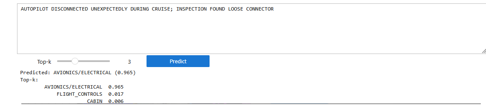

# SDR-BERT Classifier

Fine-tuned **DistilBERT** model for classifying FAA Service Difficulty Reports (SDRs) into high-level aircraft system categories (e.g., **STRUCTURES, AVIONICS/ELECTRICAL, POWERPLANT, FLUID_SYSTEMS**).  
This enables automated triage and trend analysis of free-text maintenance discrepancy narratives.

---

## Project Overview
- **Goal**: Automatically categorize free-text discrepancy reports into system-level categories.
- **Motivation**:  
  SDRs contain valuable safety and reliability insights, but manual categorization is slow and inconsistent.  
  Using NLP and transfer learning, we can speed up triage and support data-driven maintenance analytics.

---

## Data
- **Source**: [FAA Service Difficulty Reporting System (SDRS)](https://sdrs.faa.gov/Query.aspx)  
- **Description**: SDRS is a public database that collects safety and reliability reports from operators, repair stations, and manufacturers.  
- **Current scope**:  
  - This first version of the model was trained **only on Boeing 767 reports**,  
  - Covering data from **Year X to Year Y** (adjust this with your actual range).  
  - Future iterations will expand to more aircraft models and broader date ranges.

---

## Sample Output

---

## Workflow
The pipeline is implemented in Jupyter notebooks:

1. **01_EDA.ipynb**  
   - Exploratory data analysis, distribution of categories, text cleaning.

2. **02_sdr_distilbert_training_pipeline.ipynb**  
   - Load and preprocess SDR dataset.  
   - Train/validation/test split with stratification.  
   - Label encoding.  
   - Tokenization with Hugging Face `AutoTokenizer`.  
   - Fine-tuning DistilBERT with weighted loss (handles class imbalance).  
   - Model evaluation (accuracy, macro-F1).  
   - Save best model + label mappings.

3. **03_interface.ipynb**  
   - Simple inference helpers.  
   - Interactive interface to type a discrepancy and get predicted category with confidence scores.

